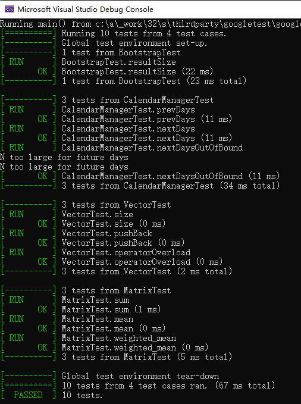
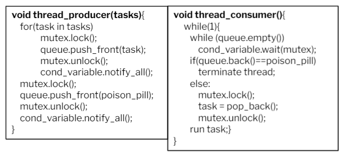
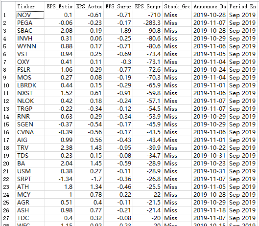
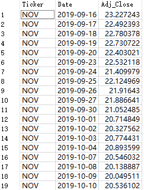
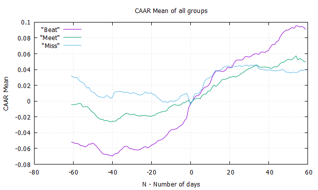
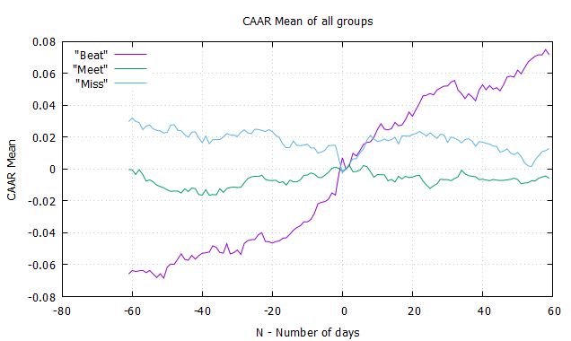
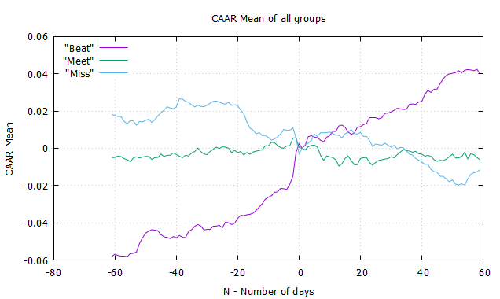

# FRE-6883-Final-Project: 
## Evaluate the impact of quarterly earnings report on stock price movement
An earnings surprise occurs when a company's reported quarterly or annual profits are above or below analysts' expectations. The tendency of stock prices to drift (over time) in the direction of earnings surprise post the announcement of earnings is termed as PEAD anomaly. If the element of surprise in the announced earnings is positive in magnitude, the stock prices drift positively and vice versa.

## Environment 
### Configure LibCurl (Microsoft Visual Studio)
- Download the zipped file /external_lib/libcurl-vc16-x86-debug-tatic-ipv6-spi-channel.zip and unzip the file.

- Go to **Properties > Configuration Properties > C/C++ > General** . Add the **libcurl-vc16-x86-debug-tatic-ipv6-spi-channel\include** for **Additional Include Directories**

- Go to **Properties > Configuration Properties > C/C++ > Preprocessor**. Add the following into **Preprocessor Definitions**:
```
_CRT_SECURE_NO_WARNING
CURL_STATICLIB
```
- Go to **Properties > Configuration Properties > Linker > General**. Add **libcurl-vc16-x86-debug-tatic-ipv6-spi-channel\lib** for **Additional Library
Directories**.

- Then click **Linker > Input> Additional Dependencies**. Add the following libraries to it:
```
normaliz.lib
ws2_32.lib
wldap32.lib
crypt32.lib
libcurl_a_debug.lib
advapi32.lib
```
### Configure Sqlite3 (Microsoft Visual Studio)
- Download the zipped file /external_lib/sqlite3_win64_x64 and unzip the file.

- Go to **Properties > Configuration Properties > C/C++ > General** . Add the folder path for **Additional Include Directories**

- Go to **Properties > Configuration Properties > Linker > General**. Add the folder path for **Additional Library Directories**.
- Then click **Linker > Input> Additional Dependencies**. Add the following libraries to it: 
```
sqlite3.lib
```

## Development & Design
### Test-Driven development
We use [google test](https://github.com/google/googletest) to unit test our tasks based on initial designs. Google Test is integrated into the Visual Studio IDE as a default component of the Desktop Development with C++ workload. Feel free to run the unit test cases in **gtest** folder.



### Multi-thread download data from Yahoo Finance
We use producer-consumer model and create a thread pool to handle the download task. The time consumption decreases from 760s to 88s with a pool of 10 threads. 



### Manage local data with SQLite3 DB
We store the historical data fetched from Yahoo Finance to a local sqlite3 databse **finance.db**. After that, we can load data from db file and the time consumption decrease from 660s to 13s. The project is then more obust to Internet/Yahoo API conditions.

StockInfo table



MarketData table




## Research Result
**IWB as benchmark**

equal weights to calculate AAR




IWB weights to calculate AAR (use IWB 12/31/2020 weights)



**EQAL as benchmark**

