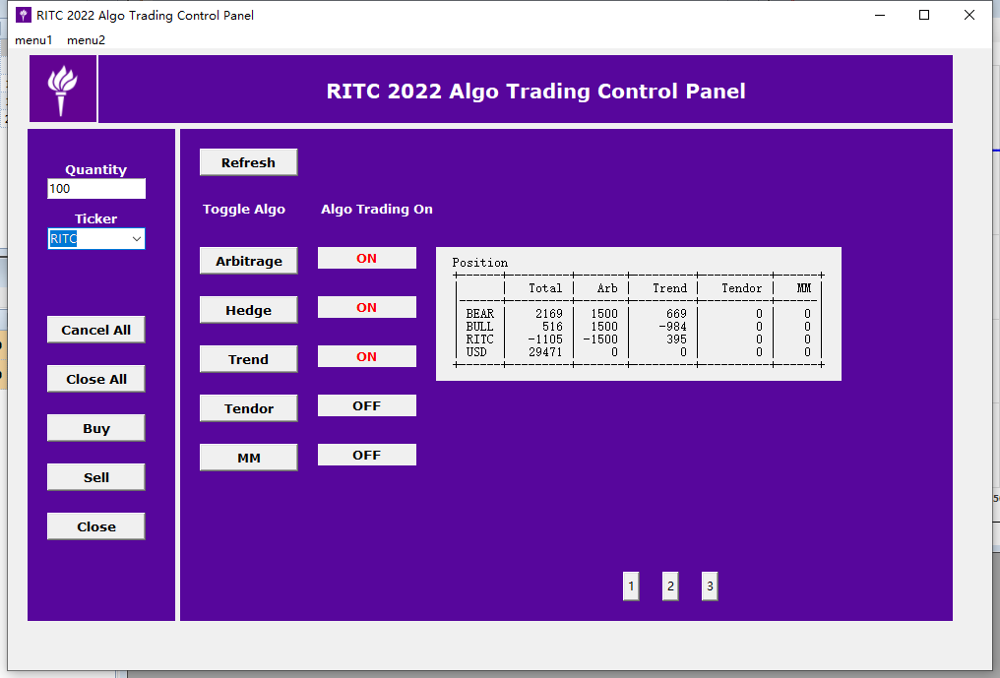

# RITC_AlgoTrading
My algorithms for RITC Algo Trading competition 2022

## Environment
- python
- tkinter
- get API Key from RIT 2.0 Client

## Run
1. Open and login RIT 2.0 Client
2. Run main.py
3. Click 'toggle algo' to make algo trading on

## Strategy
1. BaseStrategy: base class for strategies
2. EtfArbitrageStrategy: ETF/BULL/BEAR arbitrage
3. HedgeFxStrategy: hedge USD risk for a USD neutral strategy. Don't use this if willing to take exposure on USD.
4. TrendStrategy: short term trend-following
5. TendorStrategy: accept tendor offers if profitable
6. MmStrategy: market making
7. CombineStrategy: strategy traded in on portfolio

## Todo:
1. MmStrategy: market making
